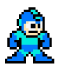

Thinking of making a 2D platformer sprite game where:

* The player character can jump, double jump, and shoot
* The level design is directly based on a song - jump, double jump, or shoot on every beat
* The character runs by itself and the level scrolls at the pace of the music
* Character design can be inspired by Megaman:  

Definitely more to come. First I'll be trying out [Godot](https://godotengine.org/) and going through tutorials.